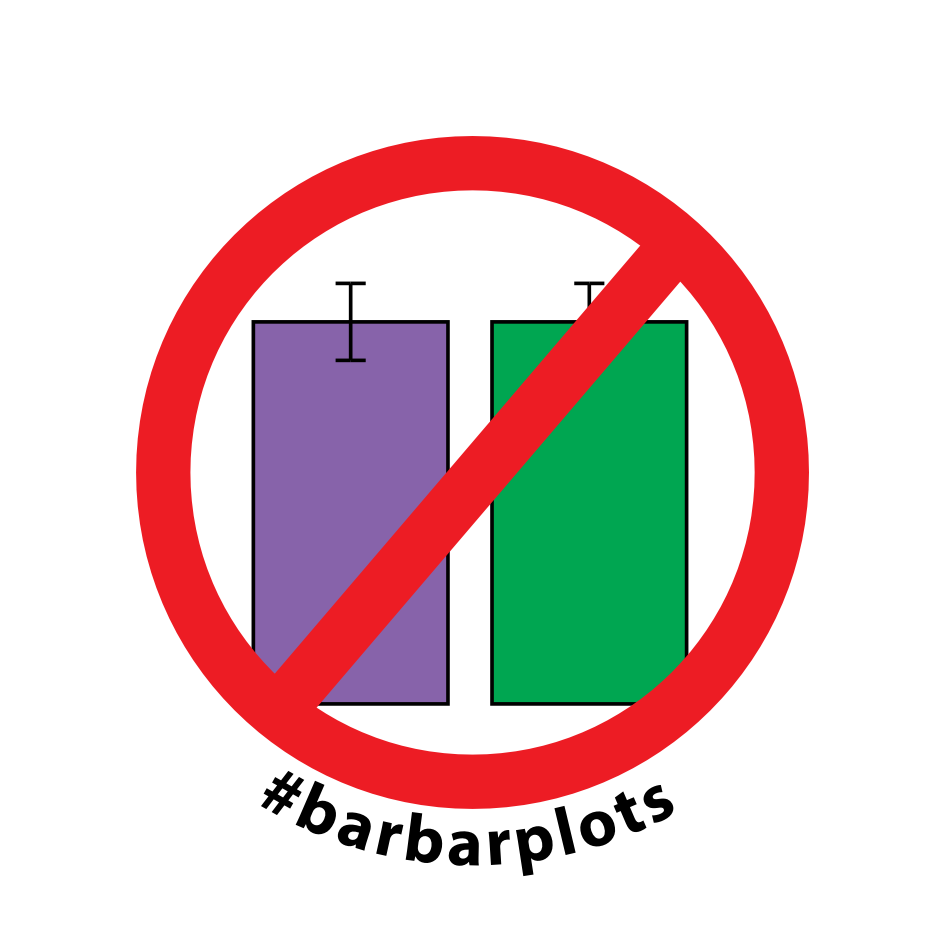
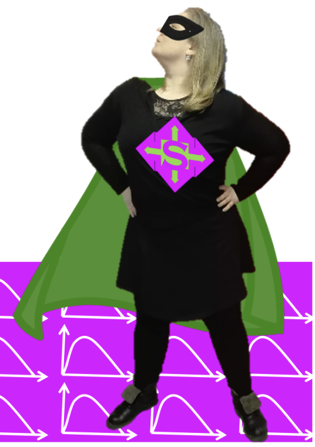
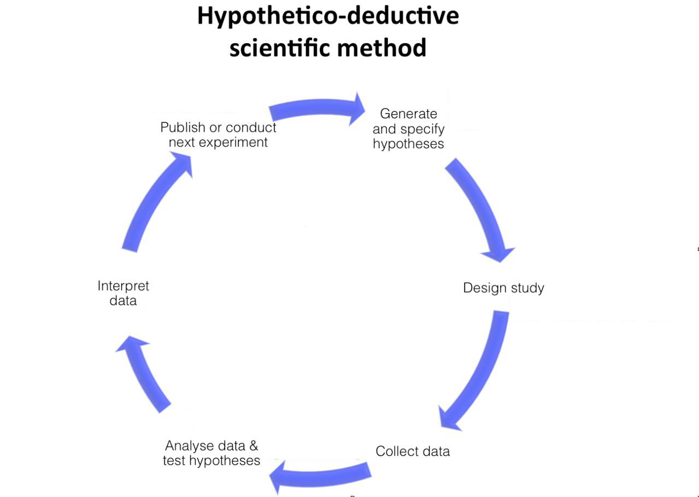
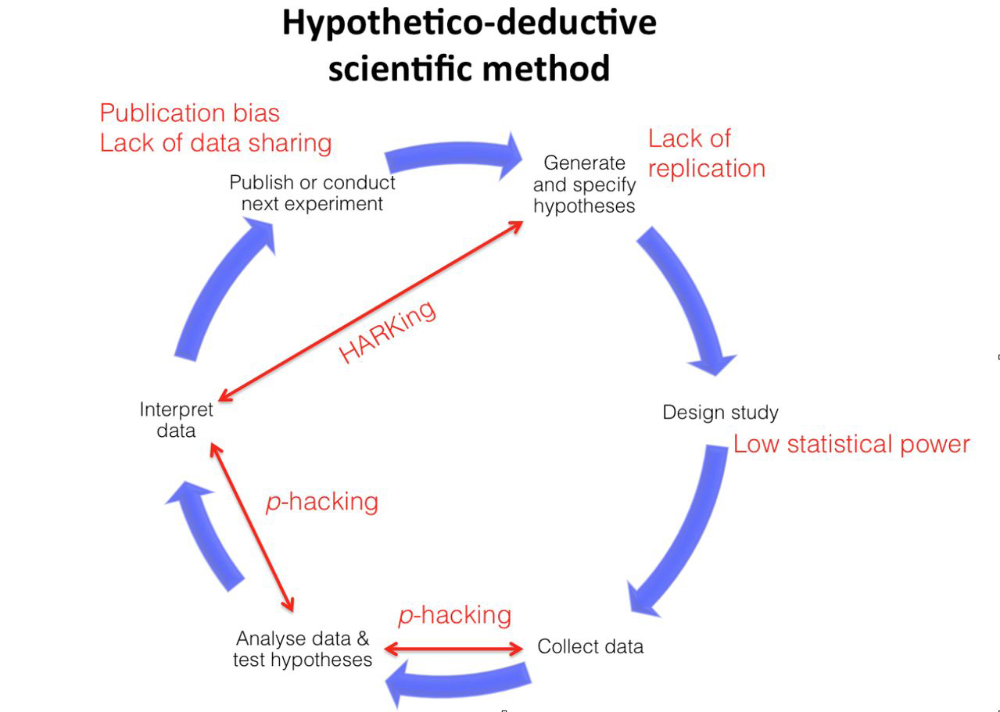
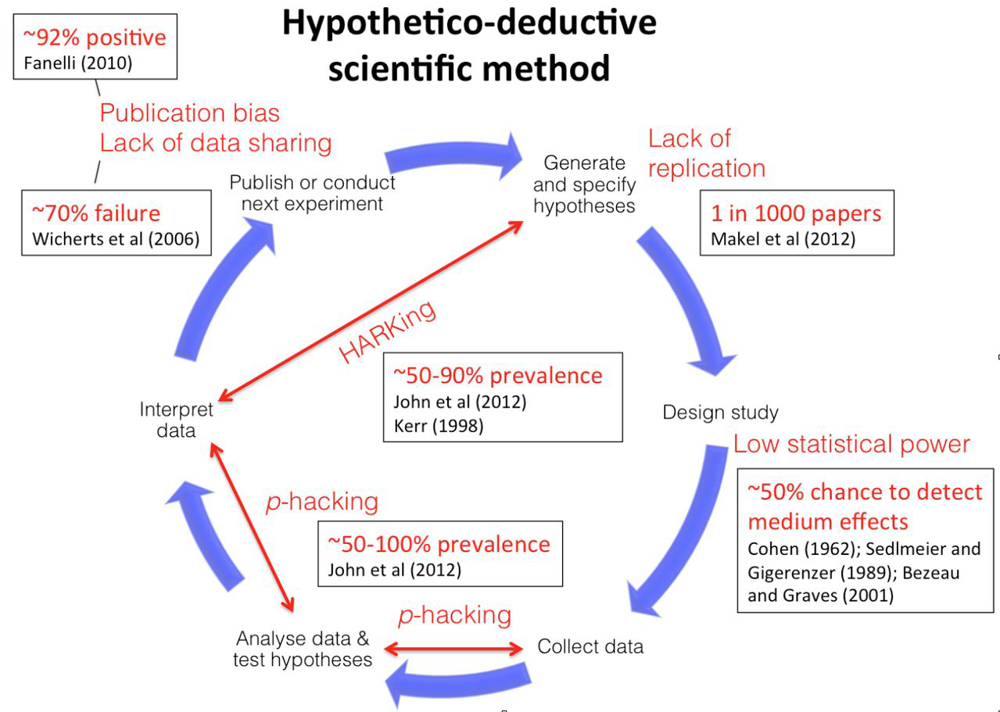
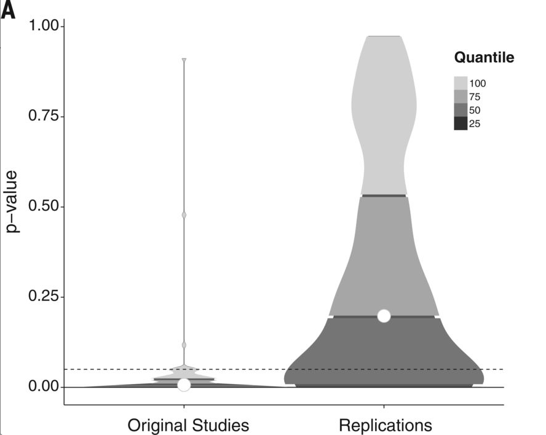
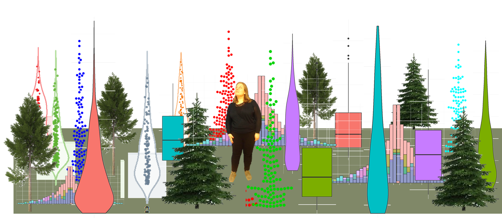
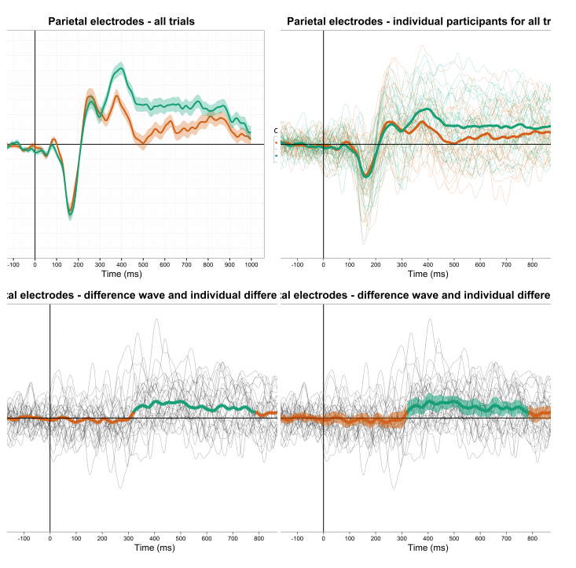

```{r setup, include=FALSE}
library(ggplot2)
library(gridExtra)
library(dplyr)
library(tidyr)
colors <- c("#999999", "#E69F00", "#56B4E9", "#009E73", "#F0E442", "#0072B2", "#D55E00", "#CC79A7")
```


## Overview

>1. Why me?
>2. The bigger picture: Transparency and reproducibility
>3. Current practices in life sciences
>4. What's wrong with bar plots?
>5. So many alternatives, which to pick?


## Why me?

Current job: Post doc in Paris ([École Normale Supérieure](https://en.wikipedia.org/wiki/École_Normale_Supérieure), Laboratoire de Sciences Cognitives et Psycholinguistique) 

## Why me?

Current job: Post doc in Paris ([École Normale Supérieure](https://en.wikipedia.org/wiki/École_Normale_Supérieure), Laboratoire de Sciences Cognitives et Psycholinguistique) 

Background: Cognitive Science, Neuroscience 

Experience: Human (adult, child, baby) data, Computational models, Meta-analyses


## Why me?

"#barbarplots" campaign   [barbarplots.github.io](http://barbarplots.github.io/)


## Why me?

"#barbarplots" campaign   [barbarplots.github.io](http://barbarplots.github.io/)

Contact:  @chbergma and  christinabergmann

[Personal website](https://sites.google.com/site/chbergma/)

[Blog: CogTales ](https://cogtales.wordpress.com)

## The bigger picture: Transparency and reproducibility




^[Source](http://www.aimspress.com/article/10.3934/Neuroscience.2014.1.4/fulltext.html)^

^[See also](https://osf.io/8mpji/wiki/1.%20Details%20and%20Workflow/)^


## The bigger picture: Transparency and reproducibility




^[Source](http://www.aimspress.com/article/10.3934/Neuroscience.2014.1.4/fulltext.html)^

^[See also](https://osf.io/8mpji/wiki/1.%20Details%20and%20Workflow/)^


## The bigger picture: Transparency and reproducibility




^[Source](https://osf.io/8mpji/wiki/1.%20Details%20and%20Workflow/)^


## The ensuing "crisis"



^[Source](http://science.sciencemag.org/content/349/6251/aac4716.figures-only)^

^[See also](https://thewinnower.com/papers/4825-crisis-in-what-exactly)^


## The ensuing "crisis"


^[Source](http://science.sciencemag.org/content/349/6251/aac4716.figures-only)^

^[See also](https://thewinnower.com/papers/4825-crisis-in-what-exactly)^


## Current practices in life sciences

Data? Distributions 

Inference? Statistical tests 

> A typical paper reports t(23) = 5.721, p < .05. If we are lucky, we get descriptive data. 

What have we learned from this? Not much, actually! 


## The bigger picture: Transparency and reproducibility


^[Source](http://www.aimspress.com/article/10.3934/Neuroscience.2014.1.4/fulltext.html)^

^[See also](https://osf.io/8mpji/wiki/1.%20Details%20and%20Workflow/)^


## What does plotting have to do with all this?

- Figures are what you remember of a story
- Interpretations and conclusions rest on (misleading) figures

## What does plotting have to do with all this?

>- Figures are what you remember of a story
>- Interpretations and conclusions rest on (misleading) figures


```{r Fig:MisleadBar, echo=FALSE}

mean = c(9.5, 9.75)
sd = c(.25, .25)
key = c("Lucie", "Jane")

misleading_data_bar = data.frame(mean, sd, key)
misleading_data_bar$sd_min = mean-sd
misleading_data_bar$sd_max = mean+sd
  
data.barplot = ggplot(misleading_data_bar, aes(x = key, y = mean)) +
  geom_bar(stat = "identity", aes(fill = key, alpha = .5)) +
  #geom_errorbar(aes(ymin = sd_min, ymax = sd_max), width = 0.25, lwd=1) +
  coord_cartesian(ylim=c(9,10), expand = FALSE) +
  scale_fill_manual(values = c(colors[[1]], colors[[6]])) +
  xlab("") +
  ylab("Score") +
  theme_classic() +
  theme(axis.line.y = element_line(), legend.position = "none", legend.key = element_blank(),
        text=element_text(size=24), panel.grid.major = element_blank(), panel.grid.minor = element_blank(),
        legend.title = element_blank(), axis.text.y = element_blank())

data.barplot

```


## What does plotting have to do with all this?

>- Figures are what you remember of a story
>- Interpretations and conclusions rest on (misleading) figures

```{r Fig:MisleadBar2, echo=FALSE}

data.barplot = ggplot(misleading_data_bar, aes(x = key, y = mean)) +
  geom_bar(stat = "identity", aes(fill = key, alpha = .5)) +
  #geom_errorbar(aes(ymin = sd_min, ymax = sd_max), width = 0.25, lwd=1) +
  coord_cartesian(ylim=c(9,10), expand = FALSE) +
  scale_fill_manual(values = c(colors[[1]], colors[[6]])) +
  xlab("") +
  ylab("Score") +
  theme_classic() +
  theme(axis.line.y = element_line(), legend.position = "none", legend.key = element_blank(),
        text=element_text(size=24), panel.grid.major = element_blank(), panel.grid.minor = element_blank(),
        legend.title = element_blank())

data.barplot

```


## What does plotting have to do with all this?

>- Figures are what you remember of a story
>- Interpretations and conclusions rest on (misleading) figures

```{r Fig:MisleadBar3, echo=FALSE}

data.barplot = ggplot(misleading_data_bar, aes(x = key, y = mean)) +
  geom_bar(stat = "identity", aes(fill = key, alpha = .5)) +
  #geom_errorbar(aes(ymin = sd_min, ymax = sd_max), width = 0.25, lwd=1) +
  coord_cartesian(ylim=c(0,10), expand = FALSE) +
  scale_fill_manual(values = c(colors[[1]], colors[[6]])) +
  xlab("") +
  ylab("Score") +
  theme_classic() +
  theme(axis.line.y = element_line(), legend.position = "none", legend.key = element_blank(),
        text=element_text(size=24), panel.grid.major = element_blank(), panel.grid.minor = element_blank(),
        legend.title = element_blank())

data.barplot

```


## What does plotting have to do with all this?

Figures might reinforce bad practices 

- Binary thinking
    - Real life is more complicated
    - One study is not "the truth", there is actually **uncertainty** in every datum
    - We want to build on each others' work (and need the data for that)
        - What could we expect in a replication?


## What does plotting have to do with all this?


```{r Fig:WeissgerberBar, echo=FALSE}
#These data are constructed based on data kindly shared by Tracy Weissgerber to reconstruct and play with different datasets which have the same mean. The original figure and the paper, along with follow-up work, can be found in this presentation in upcoming slides.
SampleA = c(1.1, 5, 7, 9, 10, 10, 4.6)
SampleC = c(4.6, 4.95, 6.2, 6.6, 15, 2, 7.4)
SampleD = c(5, 5.25, 4.3, 3, 9.2, 9.6, 10.4)
SampleB = c(5, 7.55, 9.65, 4.5, NA, NA, NA)

data.c = data.frame(SampleA, SampleB, SampleC, SampleD)

data = na.omit(gather(data.c))

data_bar = data %>%
  group_by(key) %>%
  summarise(mean = mean(value),
            sd = sd(value)) %>%
  ungroup() %>%
  mutate(sd_min = mean - sd) %>%
  mutate(sd_max = mean + sd)

data.barplot = ggplot(data_bar, aes(x = key, y = mean)) +
  geom_bar(stat = "identity", aes(fill = key, alpha = .5)) +
  #geom_errorbar(aes(ymin = sd_min, ymax = sd_max), width = 0.25, lwd=1) +
  coord_cartesian(ylim=c(0,16), expand = FALSE) +
  scale_fill_manual(values = c(colors[[6]], colors[[7]], colors[[8]], colors[[1]])) +
  xlab("") +
  ylab("") +
  theme_classic() +
  theme(axis.line.y = element_line(), legend.position = "none", legend.key = element_blank(),
        text=element_text(size=24), panel.grid.major = element_blank(), panel.grid.minor = element_blank(),
        legend.title = element_blank())

data.barplot

```


Adapted from [Weissgerber et al. (2015)](http://journals.plos.org/plosbiology/article?id=10.1371/journal.pbio.1002128)


## What does plotting have to do with all this?


```{r Fig:WeissgerberBar2, echo=FALSE}

data.barplot = ggplot(data_bar, aes(x = key, y = mean)) +
  geom_bar(stat = "identity", aes(fill = key, alpha = .5)) +
  geom_errorbar(aes(ymin = sd_min, ymax = sd_max), width = 0.25, lwd=1) +
  coord_cartesian(ylim=c(0,16), expand = FALSE) +
  scale_fill_manual(values = c(colors[[6]], colors[[7]], colors[[8]], colors[[1]])) +
  xlab("") +
  ylab("") +
  theme_classic() +
  theme(axis.line.y = element_line(), legend.position = "none", legend.key = element_blank(),
        text=element_text(size=24), panel.grid.major = element_blank(), panel.grid.minor = element_blank(),
        legend.title = element_blank())

data.barplot

```


Adapted from [Weissgerber et al. (2015)](http://journals.plos.org/plosbiology/article?id=10.1371/journal.pbio.1002128)


## What does plotting have to do with all this?


```{r Fig:WeissgerberRaw, echo=FALSE}

data.raw = ggplot(data, aes(x = key, y = value, colour = key)) +
  #geom_violin(aes(fill = key)) +
  geom_jitter(width = .2, height = 0, size = 2.5) +
  scale_y_continuous(limits = c(0, 16), expand = c(0,0)) +
  scale_colour_manual(values = c(colors[[6]], colors[[7]], colors[[8]], colors[[1]])) +
  xlab("") +
  ylab("") +
  theme_classic() +
  theme(axis.line.y = element_line(), legend.position = "none", legend.key = element_blank(),
        text=element_text(size=24), panel.grid.major = element_blank(), panel.grid.minor = element_blank(),
        legend.title = element_blank())


data.raw

```


^Adapted from [Weissgerber et al. (2015)](http://journals.plos.org/plosbiology/article?id=10.1371/journal.pbio.1002128)^


## What does plotting have to do with all this?


```{r Fig:WeissgerberMeanRaw, echo=FALSE}

data.raw = ggplot(data, aes(x = key, y = value, colour = key)) +
  #geom_violin(aes(fill = key)) +
  geom_jitter(width = .2, height = 0, size = 2.5) +
  geom_point(data=data_bar, aes(x = key, y = mean), shape = 95, size = 24) +
  scale_y_continuous(limits = c(0, 16), expand = c(0,0)) +
  scale_colour_manual(values = c(colors[[6]], colors[[7]], colors[[8]], colors[[1]])) +
  xlab("") +
  ylab("") +
  theme_classic() +
  theme(axis.line.y = element_line(), legend.position = "none", legend.key = element_blank(),
        text=element_text(size=24), panel.grid.major = element_blank(), panel.grid.minor = element_blank(),
        legend.title = element_blank())


data.raw

```


Adapted from [Weissgerber et al. (2015)](http://journals.plos.org/plosbiology/article?id=10.1371/journal.pbio.1002128)


## What does plotting have to do with all this?

Figures might reinforce bad practices

>- Binary thinking
    - Real life is more complicated
    - One study is not "the truth", there is actually **uncertainty** in every datum
    - We want to build on each others' work (and need the data for that)
        - What could we expect in a replication?

- Suggestion of *neat* story (*p* < .05 and thus "significant")
    - We should get used to life being messy 


## What does plotting have to do with all this?


Source: [Weissgerber et al. (2015)](http://journals.plos.org/plosbiology/article?id=10.1371/journal.pbio.1002128)


## Summary: What's wrong with barplots?

We launched #barbarplots because the use of barplots is misleading for many reasons:

- Reinforcing binary thinking and "neat" data

- No informative representation of distributional data
    - What does the actual data look like?
    - Are assumptions met to conduct statistical tests?
    - Might lead to the wrong conclusions
    
- Bar surface suggests size = meaningful
    - Higher error rates do not mean better performance
    - Similarly high bars can come from 1000 or 10 samples
    
- Bar origin suggests 0 = meaningful
    - Example: coin tosses, here 50% chance level is more important
    - Even worse with a random baseline!


## The bigger picture: Transparency and reproducibility


^[Source](http://www.aimspress.com/article/10.3934/Neuroscience.2014.1.4/fulltext.html)^

^[See also](https://osf.io/8mpji/wiki/1.%20Details%20and%20Workflow/)^


## So many alternatives, which to pick?



^[Source](https://cogtales.wordpress.com/2016/07/13/datasharing-yes-please-an-attempt-at-a-beginners-guide/)^


## Means and SDs are not enough

The case of the Anscombe Quartet: Bars

```{r Fig:AnscombeBar, echo=FALSE}

anscombe_summary = gather(anscombe)
  
data_bar = anscombe_summary[45:88,] %>%
  group_by(key) %>%
  summarise(mean = mean(value),
            sd = sd(value)) %>%
  ungroup() %>%
  mutate(sd_min = mean - sd) %>%
  mutate(sd_max = mean + sd)
  
  
data.barplot = ggplot(data_bar, aes(x = key, y = mean)) +
  geom_bar(stat = "identity", aes(fill = key, alpha = .5)) +
  geom_errorbar(aes(ymin = sd_min, ymax = sd_max), width = 0.25, lwd=1) +
  coord_cartesian(ylim=c(0,16), expand = FALSE) +
  scale_fill_manual(values = c(colors[[2]], colors[[3]], colors[[4]], colors[[5]])) +
  xlab("") +
  ylab("") +
  theme_classic() +
  theme(axis.line.y = element_line(), legend.position = "none", legend.key = element_blank(),
        text=element_text(size=24), panel.grid.major = element_blank(), panel.grid.minor = element_blank(),
        legend.title = element_blank(), axis.text.x = element_blank())

data.barplot

```

## Let's look again

The case of the Anscombe Quartet: Boxes

```{r AnscombeBox, echo=FALSE, warning=FALSE}

data.box = ggplot(anscombe_summary[45:88,], aes(x = key, y = value)) +
  geom_boxplot(aes(fill = key, alpha = .5)) +
  scale_y_continuous(limits = c(0, 16), expand = c(0,0)) +
  scale_fill_manual(values = c(colors[[2]], colors[[3]], colors[[4]], colors[[5]])) +
  xlab("") +
  ylab("") +
  theme_classic() +
  theme(axis.line.y = element_line(), legend.position = "none", legend.key = element_blank(),
        text=element_text(size=24), panel.grid.major = element_blank(), panel.grid.minor = element_blank(),
        legend.title = element_blank(), axis.text.x = element_blank())


data.box
```

## Can we give even more information?

The case of the Anscombe Quartet: Boxes with raw data

```{r AnscombeBoxJitter, echo=FALSE, warning=FALSE}

data.box = ggplot(anscombe_summary[45:88,], aes(x = key, y = value)) +
  geom_boxplot(aes(fill = key, alpha = .5)) +
  geom_jitter(width = .5, shape = 5) +
  scale_y_continuous(limits = c(0, 16), expand = c(0,0)) +
  scale_fill_manual(values = c(colors[[2]], colors[[3]], colors[[4]], colors[[5]])) +
  xlab("") +
  ylab("") +
  theme_classic() +
  theme(axis.line.y = element_line(), legend.position = "none", legend.key = element_blank(),
        text=element_text(size=24), panel.grid.major = element_blank(), panel.grid.minor = element_blank(),
        legend.title = element_blank(), axis.text.x = element_blank())


data.box
```


## What if we want to see distributions?

The case of the Anscombe Quartet: Violins

```{r AnscombeViolin, echo=FALSE, warning=FALSE}

data.violin = ggplot(anscombe_summary[45:88,], aes(x = key, y = value)) +
  geom_violin(aes(fill = key, alpha = .5)) +
  scale_y_continuous(limits = c(0, 16), expand = c(0,0)) +
  scale_fill_manual(values = c(colors[[2]], colors[[3]], colors[[4]], colors[[5]])) +
  xlab("") +
  ylab("") +
  theme_classic() +
  theme(axis.line.y = element_line(), legend.position = "none", legend.key = element_blank(),
        text=element_text(size=24), panel.grid.major = element_blank(), panel.grid.minor = element_blank(),
        legend.title = element_blank(), axis.text.x = element_blank())


data.violin
```

## And now we've surely tried it all!

The case of the Anscombe Quartett: Violins and raw data

```{r AnscombeViolinJitter, echo=FALSE, warning=FALSE}

data.violin = ggplot(anscombe_summary[45:88,], aes(x = key, y = value)) +
  geom_violin(aes(fill = key, alpha = .5)) +
  geom_dotplot(binaxis="y", stackdir="center", dotsize=.5, binwidth = .5) +
  scale_y_continuous(limits = c(0, 16), expand = c(0,0)) +
  scale_fill_manual(values = c(colors[[2]], colors[[3]], colors[[4]], colors[[5]])) +
  xlab("") +
  ylab("") +
  theme_classic() +
  theme(axis.line.y = element_line(), legend.position = "none", legend.key = element_blank(),
        text=element_text(size=24), panel.grid.major = element_blank(), panel.grid.minor = element_blank(),
        legend.title = element_blank(), axis.text.x = element_blank())


data.violin
```


## So many alternatives, which to pick?

- Balance between clarity and informativeness

- Sometimes you have to experiment
    - Option: lighter subject data to emphasise "bigger picture" without hiding the actual data
    - Option: overlay / combine graphs
    


Source: [Cogtales](http://cogtales.wordpress.com)

## Thank you


Read more at [barbarplots.github.io](http://barbarplots.github.io/)


## Want to go further? 

[Gwilym Lockwood has an ERP plotting challenge going on](https://gwilymlockwood.wordpress.com/2016/07/16/erp-graph-competition/)



## References

Allen, E. A., Erhardt, E. B., & Calhoun, V. D. (2012). "Data visualization in the neurosciences: overcoming the curse of dimensionality." Neuron, 74 (4), 603-608. [Paper](http://www.sciencedirect.com/science/article/pii/S089662731200428X)

Anscombe, F. J. (1973). "Graphs in Statistical Analysis." American Statistician 27 (1): 17–21. pp. 17-21. [Paper](http://www.sjsu.edu/faculty/gerstman/StatPrimer/anscombe1973.pdf)

Open Science Collaboration. (2015). "Estimating the reproducibility of psychological science." Science, 349 (6251). [OSF project page](https://osf.io/ezcuj/)

Simmons, J. P., Nelson, L. D., & Simonsohn, U. (2011). "False-Positive Psychology: Undisclosed Flexibility in Data Collection and Analysis Allows Presenting Anything as Significant." Psychological Science, 22 (11). pp. 1359-1366. [Paper](http://pss.sagepub.com/content/22/11/1359.full)

Weissgerber, T. L., Garovic, V. D., Savic, M., Winham, S. J., & Milic, N. M. (2016). "From Static to Interactive: Transforming Data Visualization to Improve Transparency." PLoS Biol, 14(6), e1002484. [Paper](http://journals.plos.org/plosbiology/article?id=10.1371/journal.pbio.1002484)

Weissgerber, T. L., Garovic, V. D., Winham, S. J., Milic, N. M., & Prager, E. M. (2016). Transparent reporting for reproducible science. Journal of Neuroscience Research. Editorial. [Paper](http://onlinelibrary.wiley.com/doi/10.1002/jnr.23785/full)

Weissgerber, T. L., Milic, N. M., Winham, S. J., & Garovic, V. D. (2015). "Beyond bar and line graphs: Time for a new data presentation paradigm." PLoS Biology, 13(4), e1002128. [Paper](http://journals.plos.org/plosbiology/article?id=10.1371/journal.pbio.1002128)


## Journals discouraging barplots

>- Nature Neuroscience
>- Journal of Neuroscience Research
>- European Journal of Neuroscience
>- PLoS Biology


## Bonus slide

The case of the Anscombe Quartett - the classical plot
```{r AnscombeScatter, echo = FALSE, warning = FALSE}

p1 <- ggplot(anscombe) + 
  geom_point(aes(x1, y1), color = colors[[2]], size = 3) + 
  scale_x_continuous(breaks = seq(0, 20, 2), limits = c(0, 20), expand = c(0,0)) + 
  scale_y_continuous(breaks = seq(0, 12, 2), limits = c(0, 12), expand = c(0,0)) + 
  geom_abline(intercept = 3, slope = 0.5, color = colors[[1]]) + 
  expand_limits(x = 0, y = 0) + 
  xlab("") +
  ylab("") +
  theme_bw() +
  theme(text=element_text(size=24), title=element_text(size=24), panel.border = element_blank(), panel.grid.major = element_blank(), panel.grid.minor = element_blank(), axis.line.x = element_line(), axis.line.y = element_line(), legend.position = "none", legend.key = element_blank(), legend.title = element_blank(), strip.background = element_rect(color="white", fill="white"))

p2 <- ggplot(anscombe) + geom_point(aes(x2, y2), color = colors[[3]], size = 3) + 
  scale_x_continuous(breaks = seq(0, 20, 2), limits = c(0, 20), expand = c(0,0)) + 
  scale_y_continuous(breaks = seq(0, 12, 2), limits = c(0, 12), expand = c(0,0)) + 
  geom_abline(intercept = 3, slope = 0.5, color = colors[[1]]) + 
  expand_limits(x = 0, y = 0) + 
  xlab("") +
  ylab("") +
  theme_bw() +
  theme(text=element_text(size=24), title=element_text(size=24), panel.border = element_blank(), panel.grid.major = element_blank(), panel.grid.minor = element_blank(), axis.line.x = element_line(), axis.line.y = element_line(), legend.position = "none", legend.key = element_blank(), legend.title = element_blank(), strip.background = element_rect(color="white", fill="white"))

p3 <- ggplot(anscombe) + geom_point(aes(x3, y3), color = colors[[4]], size = 3) + 
  scale_x_continuous(breaks = seq(0, 20, 2), limits = c(0, 20), expand = c(0,0)) + 
  scale_y_continuous(breaks = seq(0, 12, 2), limits = c(0, 12), expand = c(0,0)) + 
  geom_abline(intercept = 3, slope = 0.5, color = colors[[1]]) + 
  expand_limits(x = 0, y = 0) + 
  xlab("") +
  ylab("") +
  theme_bw() +
  theme(text=element_text(size=24), title=element_text(size=24), panel.border = element_blank(), panel.grid.major = element_blank(), panel.grid.minor = element_blank(), axis.line.x = element_line(), axis.line.y = element_line(), legend.position = "none", legend.key = element_blank(), legend.title = element_blank(), strip.background = element_rect(color="white", fill="white"))

p4 <- ggplot(anscombe) + geom_point(aes(x4, y4), color = colors[[5]], size = 3)  + 
  scale_x_continuous(breaks = seq(0, 20, 2), limits = c(0, 20), expand = c(0,0)) + 
  scale_y_continuous(breaks = seq(0, 12, 2), limits = c(0, 12), expand = c(0,0)) + 
  geom_abline(intercept = 3, slope = 0.5, color = colors[[1]]) + 
  expand_limits(x = 0, y = 0) + 
  xlab("") +
  ylab("") +
  theme_bw() +
  theme(text=element_text(size=24), title=element_text(size=24), panel.border = element_blank(), panel.grid.major = element_blank(), panel.grid.minor = element_blank(), axis.line.x = element_line(), axis.line.y = element_line(), legend.position = "none", legend.key = element_blank(), legend.title = element_blank(), strip.background = element_rect(color="white", fill="white"))

grid.arrange(p1, p2, p3, p4)
```